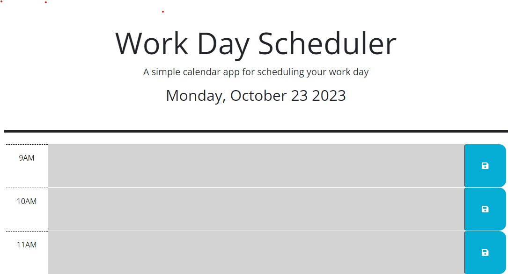

# Event-Planner
## Description

The associated web application is an interactive calendar built with dynamic HTML, CSS, and JQuery. 

Users should see the current date at the top of the planner and depending on the time of day, see areas designated (by color) for the present, past, and future time. Each text area can be used to enter an event and then the entry will be saved to local storage for future access. 

The acceptance criteria were as follows:

#Acceptance Criteria
```md
GIVEN I am taking a code quiz
GIVEN I am using a daily planner to create a schedule
WHEN I open the planner
THEN the current day is displayed at the top of the calendar
WHEN I scroll down
THEN I am presented with timeblocks for standard business hours of 9am&ndash;5pm
WHEN I view the timeblocks for that day
THEN each timeblock is color coded to indicate whether it is in the past, present, or future
WHEN I click into a timeblock
THEN I can enter an event
WHEN I click the save button for that timeblock
THEN the text for that event is saved in local storage
WHEN I refresh the page
THEN the saved events persist
```

All of the acceptance criteria were met and the site functions as expected.

I learned how to navigate the DOM using jquery to create dynamic pages. Utilizing jquery required a bit more thought, first considering how it may be resolved in Javascript and then working to make a solution that was compatible. Implementing this short-hand syntax really was a new way of thinking. I realized how different traversing the DOM is in jquery. For instance, selecting all id attributes requires less text. Likewise, I saw how identifying attributes and values was simplified because of how direct the language and syntax are. While problem-solving in this language required a shift, I appreciated the experience of thinking about things in a new way. Previous eureka moments were just as valuable here - reformatting code, implementing clear naming convention, and notating often.  I am still working to make this a part of the build process. 
## Usage

The html, css, and js files can be used to understand the dynamic code that supports the application. A link to the mockup is listed below, for your convenience. 

https://watsona22.github.io/Event-Planner/

## License

MIT License

Copyright (c) [2023] [Amber Watson]

Permission is hereby granted, free of charge, to any person obtaining a copy
of this software and associated documentation files (the "Software"), to deal
in the Software without restriction, including without limitation the rights
to use, copy, modify, merge, publish, distribute, sublicense, and/or sell
copies of the Software, and to permit persons to whom the Software is
furnished to do so, subject to the following conditions:

The above copyright notice and this permission notice shall be included in all
copies or substantial portions of the Software.

THE SOFTWARE IS PROVIDED "AS IS", WITHOUT WARRANTY OF ANY KIND, EXPRESS OR
IMPLIED, INCLUDING BUT NOT LIMITED TO THE WARRANTIES OF MERCHANTABILITY,
FITNESS FOR A PARTICULAR PURPOSE AND NONINFRINGEMENT. IN NO EVENT SHALL THE
AUTHORS OR COPYRIGHT HOLDERS BE LIABLE FOR ANY CLAIM, DAMAGES OR OTHER
LIABILITY, WHETHER IN AN ACTION OF CONTRACT, TORT OR OTHERWISE, ARISING FROM,
OUT OF OR IN CONNECTION WITH THE SOFTWARE OR THE USE OR OTHER DEALINGS IN THE
SOFTWARE.
